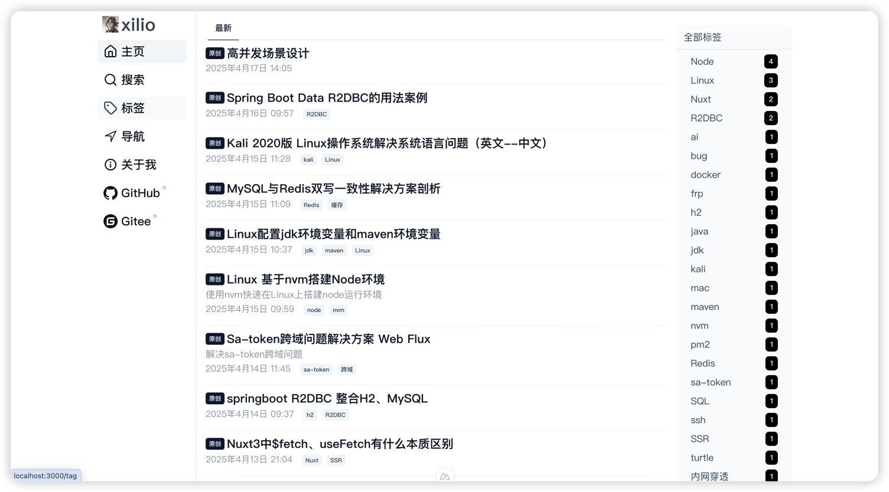
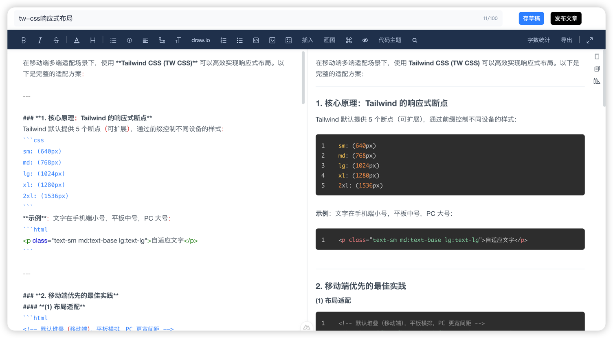
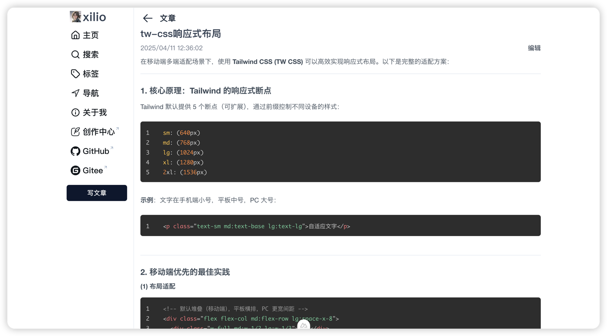
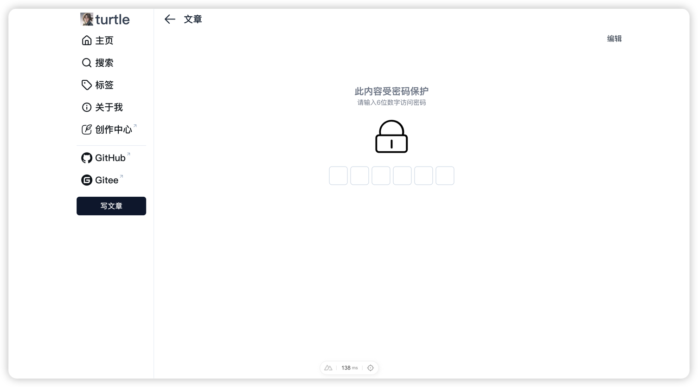
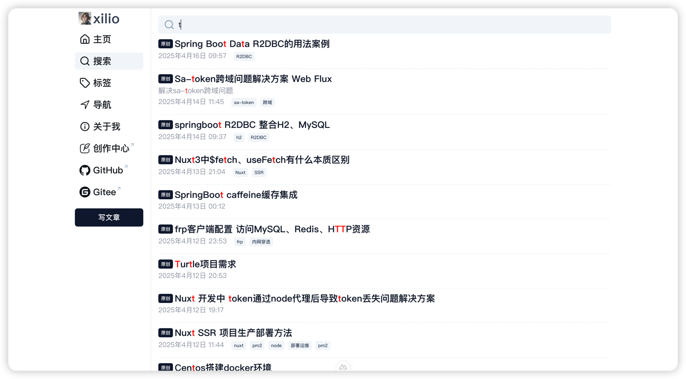

# Turtle 🐢

 
  [](https://github.com/StackOak/turtle)
  [](https://github.com/StackOak/turtle)
  [](https://github.com/StackOak/turtle/issues) 
  [](https://github.com/StackOak/turtle/blob/main/LICENSE)
  [](https://github.com/StackOak/turtle/commits)
 

一个简洁且交互友好的个人写作网站，单页面交互设计，减少跳转疲劳，基于Nuxt SSR实现服务端渲染，更利于SEO；后端完全采用响应式编程。

## 📸 项目截图 

<p align="center">
  <br>
  <strong>登录后首页</strong>
</p>

<p align="center">
  <br>
  <strong>未登录首页</strong>
</p>

<p align="center">
  <br>
  <strong>文章编辑器</strong>
</p>

<p align="center">
  <br>
  <strong>文章详情页</strong>
</p>

<p align="center">
  <br>
  <strong>加密文章</strong>
</p>

<p align="center">
  <br>
  <strong>统一搜索</strong>
</p>

## 🚀快速开始 
开发环境要求：
- 安装Jdk17即以上版本
- Maven环境 装最新版本即可
- Node 18及以上版本

1、启动服务端
- 创建MySQL数据库 脚本在resources/schema/turtle_mysql_v1.0.2.sql 并在application-mysql.yml中配置用户名和密码。

- 运行Setup即可启动服务端
  
2、启动前端
```shell
pnpm install

pnpm run dev
```
门户首页访问地址： 127.0.0.1:3000

管理端登陆地址：127.0.0.1:3000/console/login （用户名：admin  密码：123456）

## 🛠 技术栈

### 后端技术

| **类别**       | **技术**                     | **说明**                          |
|----------------|-----------------------------|----------------------------------|
| **核心框架**    | Spring Boot 3 + JDK 17      | JDK17        |
| **数据层**      | Spring R2DBC + R2DBC-MySQL  | ***异步非阻塞***的数据库访问方案            |
| **数据库**      | MySQL                       | 开源关系型数据库                     |
| **接口文档**    | Swagger UI                  | API可视化调试工具                 |
| **安全认证**    | Sa-Token                    | 权限认证框架                 |
| **分布式ID**    | Baidu UID                   | 百度提供的唯一ID生成服务            |

### 前端技术

| **类别**       | **技术**                     | **说明**                          |
|----------------|-----------------------------|----------------------------------|
| **框架**       | Nuxt 3                      | 基于Vue 3的SSR服务端渲染框架                   |
| **UI组件**      | Nuxt UI                    | Nuxt官方UI组件库                      |
| **CSS样式**      | Tailwind                   | 只写html不写css                      |
| **构建工具**    | Vite                        | 下一代前端工具链                  |
| **运行时**      | Node 18                     | JavaScript运行环境               |
| **编辑器**      | Cherry Markdown Editor      | 腾讯Markdown编辑器，专为程序猿而设计，人性化              |

## 📈 项目趋势

<p align="center">
  <a href="https://github.com/StackOak/turtle/stargazers">
    
  </a>
</p>

# 📬 联系作者
- GitHub: [StackOak/turtle](https://github.com/StackOak/turtle)
- 邮箱: 请通过 GitHub Issues 联系 ｜ xilio1024@gmail.com

# 📜 License
[Apache License 2.0](https://github.com/StackOak/turtle/blob/main/LICENSE) 
 
